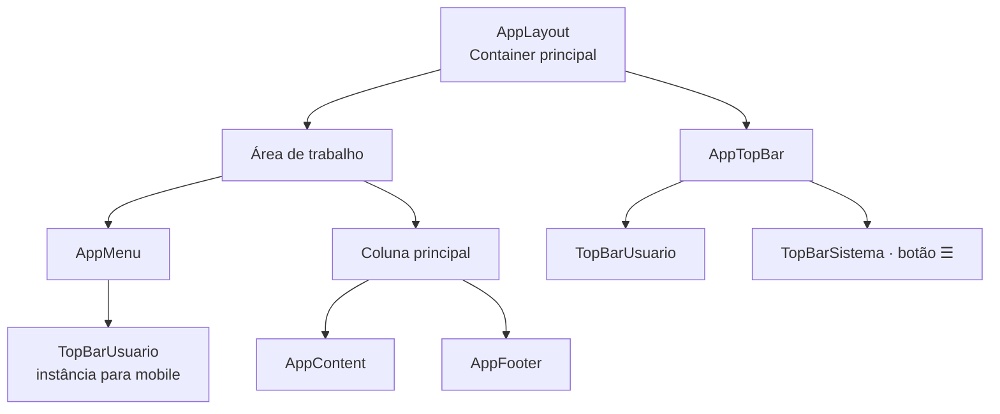
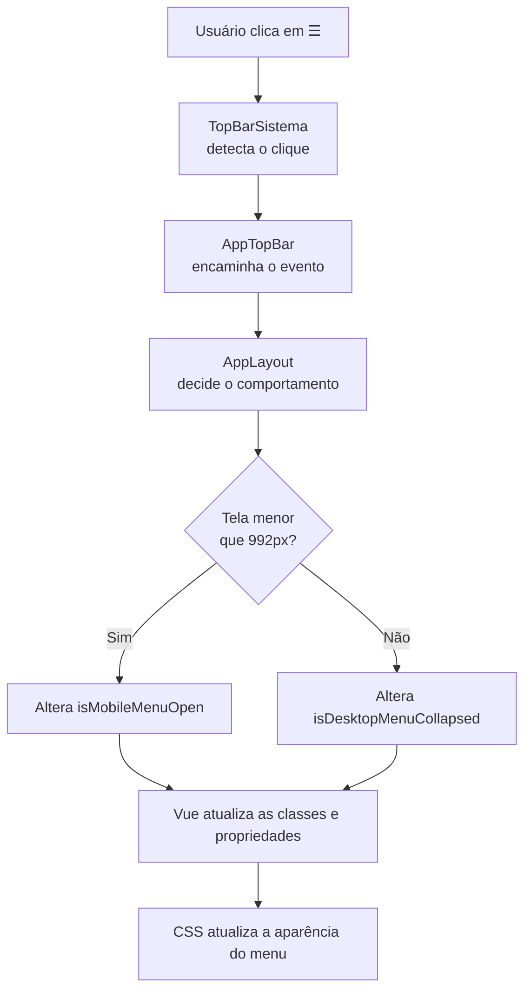

# ☰ Menu recolhível em Vue

> 📖 Guia didático para criar, compreender e reutilizar um menu lateral
> recolhível e responsivo em aplicações Vue.

---
---

## 🎯 Objetivo deste documento

Este material explica, passo a passo, como foi implementado o botão
`☰` do menu lateral no projeto **Sistema de Controle de Estoque**.

Ao finalizar o estudo, você deverá ser capaz de:

- compreender o caminho completo do clique no botão até a alteração visual;
- recriar um menu lateral recolhível em outro projeto Vue;
- diferenciar o comportamento necessário para desktop e mobile;
- entender os componentes Vue, eventos, propriedades e classes CSS envolvidos;
- diagnosticar os erros mais comuns dessa implementação.

> 💡 Como estudar este material
>
> Leia os tópicos na sequência. Os exemplos serão baseados no código real
> deste projeto e, depois, transformados em um padrão reutilizável para
> qualquer aplicação Vue.

---
---

## 🧭 Organização do conteúdo

Este documento está dividido em duas partes:

1. **Implementação no Sistema de Controle de Estoque**  
   Explica exatamente como o nosso layout e o nosso botão foram construídos.

2. **Padrão reutilizável para outros projetos Vue**  
   Transforma a solução em uma receita que pode ser aplicada em outra aplicação.

---
---

## 1. 🔍 Visão geral do comportamento

O botão `☰` controla o menu lateral, mas seu efeito depende da largura atual da tela.

| Ambiente | Largura da tela | Comportamento do botão `☰` |
|---|---:|---|
| Desktop | A partir de `992px` | Recolhe ou restaura o menu lateral dentro do layout. |
| Mobile e tablet | Abaixo de `992px` | Abre ou fecha o menu como um painel sobre o conteúdo. |

#### 🖥️ No desktop

O menu lateral faz parte permanente da estrutura da tela.

Inicialmente, ele ocupa uma coluna de `16rem` de largura e mostra ícones e textos, como **HOME** e **Listar Produtos**.

Ao clicar em `☰`:

- a coluna lateral fica menor;
- os textos do usuário e dos itens do menu são ocultados;
- os ícones continuam visíveis;
- a área de conteúdo ganha o espaço que o menu deixou de ocupar.

Clicar novamente restaura o menu completo.

> 💡 Por que não escondemos o menu no desktop?
>
> Porque os ícones continuam oferecendo acesso rápido às funcionalidades.
> O objetivo é ganhar espaço sem fazer a navegação desaparecer.

#### 📱 No mobile e no tablet

Em telas menores, não há espaço suficiente para manter uma coluna lateral fixa.

Por isso:

- o menu começa fechado;
- o conteúdo usa praticamente toda a largura disponível;
- ao clicar em `☰`, o menu desliza pela esquerda e fica sobre o conteúdo;
- uma camada escura é exibida atrás do menu;
- clicar nessa camada fecha o menu novamente.

> 💡 Por que o comportamento é diferente?
>
> Um menu estreito com apenas ícones funciona bem no desktop, onde há espaço
> horizontal. Em um celular, ele desperdiçaria uma parte importante da tela e
> dificultaria a leitura. Por isso o menu mobile é temporário e ocupa uma área
> maior enquanto está aberto.

> ⚠️ Atenção
>
> Não existe um único comportamento de “recolher menu”. Temos duas interações
> diferentes: **recolher/restaurar no desktop** e **abrir/fechar no mobile**.
> Essa diferença será refletida nas variáveis de estado e no CSS.

---
---

## 2. 🏗️ Arquitetura visual do layout

O layout foi dividido em componentes pequenos. Cada componente representa uma
região visual clara da aplicação.



### 📐 Organização na tela desktop

```
┌─────────────────────┬──────────────────────────────────────────┐
│ TopBarUsuario       │ TopBarSistema: [☰] Sistema de Controle.. │
├─────────────────────┼──────────────────────────────────────────┤
│                     │                                          │
│ AppMenu             │ AppContent                               │
│                     │                                          │
│                     ├──────────────────────────────────────────┤
│                     │ AppFooter                                │
└─────────────────────┴──────────────────────────────────────────┘
```

#### 📱 Organização na tela mobile

No mobile, `TopBarUsuario` não aparece na barra superior. Ele é exibido dentro
de `AppMenu` quando o painel lateral é aberto.

```
┌────────────────────────────────────────────────────────────────┐
│ TopBarSistema: [☰] Sistema de Controle de Estoque	         │			     
├────────────────────────────────────────────────────────────────┤
│ AppContent                                                     │
│                                                                │
├────────────────────────────────────────────────────────────────┤
│ AppFooter                                                      │
└────────────────────────────────────────────────────────────────┘

Ao clicar em ☰:

┌──────────────────────┐
│ TopBarUsuario        │
├──────────────────────┤
│ AppMenu              │   ← painel temporário sobre o conteúdo
│ • HOME               │
│ • Listar Produtos    │
└──────────────────────┘
```

#### 🧩 Papel de cada componente

| Componente      | Papel na arquitetura                                         |
| --------------- | ------------------------------------------------------------ |
| `AppLayout`     | Organiza o layout inteiro e controla o estado do menu.       |
| `AppTopBar`     | Agrupa as duas áreas do topo e encaminha a ação do botão.    |
| `TopBarUsuario` | Exibe as informações resumidas do usuário.                   |
| `TopBarSistema` | Exibe o nome do sistema e contém o botão `☰`.                |
| `AppMenu`       | Exibe os links de navegação e se adapta ao desktop e mobile. |
| `AppContent`    | Reserva a área principal para as páginas da aplicação.       |
| `AppFooter`     | Ocupa a área inferior da coluna principal.                   |

> 💡 Por que `TopBarUsuario` aparece duas vezes na arquitetura?
>
> Não são dois componentes diferentes. É o mesmo componente reutilizado em
> dois locais: na barra superior no desktop e dentro do painel lateral no mobile.
> O CSS define qual instância será visível em cada tamanho de tela.

---
---

## 3. 🔄 Caminho completo do clique no botão `☰`

O botão está visualmente em `TopBarSistema`, mas ele não controla o menu
diretamente. Cada componente tem uma responsabilidade específica.



#### 📤 A ação sobe pelos componentes

O clique começa em `TopBarSistema` e sobe até `AppLayout`.

| Etapa | Componente      | Ação                                            |
| ----: | --------------- | ----------------------------------------------- |
|     1 | `TopBarSistema` | Detecta o clique no botão `☰`.                  |
|     2 | `TopBarSistema` | Emite o evento `toggle-menu`.                   |
|     3 | `AppTopBar`     | Recebe esse evento e o encaminha.               |
|     4 | `AppLayout`     | Recebe o evento final e executa `toggleMenu()`. |

#### 🧠 A decisão acontece em `AppLayout`

`AppLayout` verifica a largura atual da tela:

- abaixo de `992px`: abre ou fecha o painel mobile;
- a partir de `992px`: recolhe ou restaura o menu desktop.

Essa decisão não deve ficar em `TopBarSistema` ou em `AppMenu`.

> 💡 Por que `AppLayout` toma a decisão?
>
> Porque ele é o único componente que enxerga simultaneamente o topo, o menu
> e a área de conteúdo. Ele também é o dono do estado que define como todo o
> layout deve se comportar.

#### 📥 O resultado desce para os componentes

Depois que `AppLayout` altera uma variável de estado, o Vue atualiza a tela:

- no desktop, uma classe é adicionada ou removida em `AppLayout`;
- no mobile, `AppMenu` recebe uma propriedade informando se deve ficar aberto;
- o CSS interpreta essas classes e propriedades para alterar largura, textos,
  posição e visibilidade.

#### 🔑 Regra de arquitetura utilizada

Eventos sobem; propriedades descem.

O componente filho informa que algo aconteceu por um evento. O componente
pai toma a decisão e envia o resultado para os filhos por propriedades.

---
---

## 4. 🧠 `AppLayout`: o dono do estado do menu

`AppLayout` é o componente principal do nosso layout. Ele contém:

- o topo da aplicação;
- o menu lateral;
- a área de conteúdo;
- o rodapé.

Por enxergar todas essas partes, ele é o local correto para controlar o
comportamento do menu.

#### 🔑 O que significa “dono do estado”?

**Estado** é uma informação que pode mudar durante o uso da aplicação e que
altera o que o usuário vê na tela.

No nosso caso, precisamos guardar duas informações:

- o menu mobile está aberto ou fechado;
- o menu desktop está recolhido ou restaurado.

Essas informações não pertencem ao botão `☰`, pois o botão apenas informa que
o usuário clicou. Elas também não pertencem apenas a `AppMenu`, porque a
mudança afeta outras regiões do layout, como o topo e a área de conteúdo.

> #### 💡 Por que o estado fica em `AppLayout`?
>
> Porque `AppLayout` é o primeiro componente pai comum entre o botão do topo e
> o menu lateral. Ele recebe a ação do botão, toma a decisão e distribui o
> resultado aos componentes que precisam reagir.

#### 🧩 Responsabilidade de cada participante

| Componente | Responsabilidade |
|---|---|
| `TopBarSistema` | Detectar o clique no botão `☰`. |
| `AppTopBar` | Encaminhar esse aviso para o componente pai. |
| `AppLayout` | Guardar o estado e decidir o que deve acontecer. |
| `AppMenu` | Receber o resultado e alterar sua apresentação. |
| CSS | Aplicar a alteração visual conforme as classes recebidas. |

> ⚠️ Atenção
>
> Declarar uma variável em `AppLayout` não a torna automaticamente visível
> para os outros componentes.
>
> O `AppLayout` envia a informação necessária para `AppMenu` por meio de uma `prop`.

---
---

## 5. 📏 `mobileBreakpoint`: identificar o tipo de tela

A primeira informação de que precisamos é saber se a tela atual está no modo
mobile ou desktop.

No `AppLayout.vue`, criamos:

```ts
const mobileBreakpoint = window.matchMedia('(max-width: 991.98px)')
```
#### 🔍 O que essa linha faz?

`window.matchMedia()` é uma função do navegador que recebe uma regra CSS e
verifica se ela é verdadeira na tela atual.

A regra usada foi:
```ts
mobileBreakpoint.matches
```

| Resultado de `mobileBreakpoint.matches` | Significado                                                  |
| --------------------------------------- | ------------------------------------------------------------ |
| `true`                                  | A tela está abaixo de `992px`; devemos usar o menu mobile.   |
| `false`                                 | A tela está em `992px` ou mais; devemos usar o menu desktop. |

> #### 💡 Por que usamos 991.98px e não 992px?
> 
> O CSS mobile do projeto também usa @media (max-width: 991.98px).
> Assim, JavaScript e CSS concordam exatamente sobre o ponto em que a
> interface muda de comportamento. 
>
> A partir de 992px, ambos passam para o modo desktop.

> #### ⚠️ Atenção
> 
> `mobileBreakpoint` não informa se o menu está aberto ou fechado.
> Ele informa somente qual comportamento deve ser utilizado no momento do clique.
>
>Por isso ele não é uma ref. 
>
>As variáveis que representam o estado visual do menu são: 
> - isMobileMenuOpen 
> - isDesktopMenuCollapsed.

---
---

## 6. 📱 `isMobileMenuOpen`: estado do menu mobile

No mobile, o menu não ocupa uma coluna fixa. Ele é um painel temporário que
pode estar aberto ou fechado.

Para guardar essa informação, criamos:

```ts
const isMobileMenuOpen = ref(false)
```
#### 🏷️ Como ler esse nome?

O nome segue uma convenção útil para variáveis booleanas:

`is + elemento + condição`

Assim:
```
isMobileMenuOpen
│  │          └── está aberto?
│  └───────────── menu mobile
└──────────────── resultado verdadeiro ou falso
```

A variável pode assumir dois valores:

| Valor   | Situação visual                                |
| ------- | ---------------------------------------------- |
| `false` | O painel lateral está fechado.                 |
| `true`  | O painel lateral está aberto sobre o conteúdo. |

Ela inicia com false porque, em uma tela mobile, queremos priorizar a área
de conteúdo. 

O menu só aparece quando o usuário solicita essa navegação

#### 🔄 Por que usamos ref(false)?

- ref é uma função do Vue usada para criar um valor reativo.

- Um valor reativo informa ao Vue:

- “Quando este valor mudar, atualize automaticamente as partes da tela que dependem dele.”

- Por isso, não usamos apenas:

```ts
const isMobileMenuOpen = false
```

Uma variável comum mudaria no JavaScript, mas o Vue não teria uma forma
adequada de acompanhar essa mudança para atualizar a interface.

Com ref(false), o Vue acompanha o valor e pode:

mostrar ou ocultar o backdrop;
informar a AppMenu se o painel deve estar aberto;
aplicar a classe visual correspondente ao menu.

#### 🔑 Conceito Vue: reatividade

Reatividade é a capacidade de a interface acompanhar automaticamente uma
alteração nos dados. 

Neste caso, quando isMobileMenuOpen muda, o Vue


> #### ⚠️ Atenção
>
> Dentro do código TypeScript, o valor da ref é acessado por .value.

	```ts
	isMobileMenuOpen.value = !isMobileMenuOpen.value
	```
>Já no `<template>` , o Vue permite usar `isMobileMenuOpen`sem escrever .value.

---
---

## 7. 🖥️ `isDesktopMenuCollapsed`: estado do menu desktop

No desktop, o menu lateral permanece presente no layout. O usuário pode apenas
alternar entre duas larguras:

- menu completo: ícones e textos visíveis;
- menu recolhido: apenas ícones visíveis.

Essa informação é guardada em:

```ts
const isDesktopMenuCollapsed = ref(false)
```

#### 🏷️ Como ler esse nome?

```
is + Desktop + Menu + Collapsed
│    │         │      └── está recolhido?
│    │         └───────── menu
│    └─────────────────── comportamento desktop
└──────────────────────── resultado verdadeiro ou falso
```

| Valor   | Situação visual                                     |
| ------- | --------------------------------------------------- |
| `false` | O menu está completo, com ícones e textos.          |
| `true`  | O menu está recolhido, mostrando somente os ícones. |

A variável inicia com false porque a navegação deve ser apresentada completa
ao abrir a aplicação em uma tela desktop.

#### 🔄 Por que este estado é separado do mobile?

`isDesktopMenuCollapsed` não pode ser a mesma variável de `isMobileMenuOpen`, pois elas representam situações diferentes

| Variável                 | Pergunta que responde                      |
| ------------------------ | ------------------------------------------ |
| `isMobileMenuOpen`       | O painel temporário do mobile está aberto? |
| `isDesktopMenuCollapsed` | O menu lateral do desktop está recolhido?  |

No mobile, o menu fica fechado ou aberto sobre o conteúdo.

No desktop, o menu fica completo ou recolhido dentro da estrutura da tela.

> #### 💡 Por que usamos a palavra `Collapsed`e não `Closed` ?
> 
> Collapsed significa recolhido: o menu ainda existe e mantém seus ícones.
> Closed significaria fechado ou oculto, o que não descreve o comportamento
> implementado no desktop.

> #### ⚠️ Atenção
> 
> Usar uma única variável para desktop e mobile parece mais simples no início,
> mas mistura dois comportamentos distintos. Isso torna o código e o CSS mais
> difíceis de entender, testar e evoluir.

---
---

## 8. ⚙️ Responsabilidade da função `toggleMenu()`

As duas variáveis de estado já existem, mas alguém precisa decidir qual delas
será alterada quando o usuário aciona o botão `☰`.

Essa decisão é responsabilidade da função:

```ts
function toggleMenu()
```

#### 🎯 O que a função precisa fazer?

A função segue esta regra:

```text
O botão ☰ foi acionado
        ↓
A tela atual é mobile?
        ↓
Sim  → alternar isMobileMenuOpen
Não  → alternar isDesktopMenuCollapsed
```

Em outras palavras, o mesmo botão pode executar duas ações diferentes, porque
o comportamento necessário depende da largura atual da tela.

| Tipo de tela     | Estado alterado por `toggleMenu()` |
| ---------------- | ---------------------------------- |
| Mobile ou tablet | `isMobileMenuOpen`                 |
| Desktop          | `isDesktopMenuCollapsed`           |

#### 🚫 O que `toggleMenu()` não faz?

A função não deve:

- alterar diretamente estilos CSS;
- procurar elementos HTML com JavaScript;
- abrir ou fechar o menu manipulando classes manualmente;
- decidir quais links serão exibidos;
- conhecer detalhes visuais dos componentes filhos.

Ela apenas altera o estado. Depois disso, o Vue e o CSS cuidam da
atualização visual.

#### 🔑 Princípio aplicado

Uma função deve ter uma responsabilidade clara. Neste caso,
toggleMenu() decide qual estado do menu será alternado.

> #### 💡 Por que separar decisão e aparência?
> 
> Separar a regra da aparência deixa o código mais fácil de manter.
> `toggleMenu()` responde o que deve mudar; o CSS responde
> como a tela deve ficar

--- 
---

## 9. ❓ A condição `if (mobileBreakpoint.matches)`

Dentro de `toggleMenu()`, a primeira decisão é:

```ts
if (mobileBreakpoint.matches)
```

### 🔍 O que é `if`?

`if` significa **“se”**.

Ele executa o bloco de código interno apenas quando a condição entre parênteses
tem o valor `true`.

```ts
if (condicao)
{
    // Este código só será executado se condicao for true.
}
```

No nosso caso, a condição é:

```ts
mobileBreakpoint.matches
```

Ela consulta a regra que criamos anteriormente:

```ts
window.matchMedia('(max-width: 991.98px)')
```

Portanto, a leitura completa é:

```text
Se a largura atual da tela for menor que 992px,
execute o comportamento mobile.
```

### 📱 Resultado da condição

| Largura atual da tela | `mobileBreakpoint.matches` | O bloco do `if` é executado? |
|---:|---|---|
| `360px` | `true` | Sim |
| `768px` | `true` | Sim |
| `991px` | `true` | Sim |
| `992px` | `false` | Não |
| `1440px` | `false` | Não |

> #### 💡 Por que essa verificação ocorre dentro de `toggleMenu()`?
>
> Porque a largura da tela pode mudar enquanto a aplicação está aberta.
> A cada clique no botão `☰`, a função consulta a situação atual e executa
> a ação adequada para aquele momento.

> #### ⚠️ Atenção
>
> A condição `if` não altera nada sozinha. Ela apenas decide se as próximas
> linhas devem executar o comportamento mobile ou se a função deve seguir
> para o comportamento desktop.

---
---

## 10. 🔁 Alternando o estado do menu mobile

Quando a condição mobile é verdadeira, a função executa:

```ts
isMobileMenuOpen.value = !isMobileMenuOpen.value
```

Essa linha alterna o estado atual do menu mobile.

#### 🧩 Leitura por partes

```ts
isMobileMenuOpen.value = !isMobileMenuOpen.value
```

| Trecho | Significado |
|---|---|
| `isMobileMenuOpen` | A variável reativa que guarda o estado do menu mobile. |
| `.value` | Acessa ou altera o valor guardado dentro da `ref`. |
| `=` | Atribui um novo valor à variável. |
| `!` | Inverte um valor booleano. |

#### 🔄 O que o operador `!` faz?

O operador `!` significa **negação lógica**. Ele troca o valor booleano pelo
seu oposto.

| Valor atual | Expressão aplicada | Novo valor |
|---|---|---|
| `false` | `!false` | `true` |
| `true` | `!true` | `false` |

Por isso, a mesma linha serve para as duas ações:

```text
Menu fechado → clique → menu aberto
Menu aberto  → clique → menu fechado
```

#### 📌 Exemplo prático

Se o menu está fechado:

```ts
isMobileMenuOpen.value = false
```

Ao executar a linha:

```ts
isMobileMenuOpen.value = !isMobileMenuOpen.value
```

o Vue calcula:

```ts
isMobileMenuOpen.value = !false
isMobileMenuOpen.value = true
```

O menu passa a estar aberto.

No clique seguinte, o processo é inverso:

```ts
isMobileMenuOpen.value = !true
isMobileMenuOpen.value = false
```

O menu volta a ficar fechado.

> #### 💡 Por que usamos `.value`?
>
> `isMobileMenuOpen` foi criado com `ref(false)`. Uma `ref` é um objeto
> reativo do Vue, e o valor que ela guarda fica em `.value`.
>
> No código TypeScript, usamos `.value` para ler ou alterar esse valor.
> No `<template>`, o Vue faz esse acesso automaticamente.

#### 🔑 Resultado da alteração

Quando o valor muda, o Vue atualiza automaticamente o backdrop e envia a
nova informação para `AppMenu`. Veremos essa ligação em um tópico posterior.

---
---

## 11. 🛑 `return`: encerrar o comportamento mobile

Depois de alternar o estado mobile, a função executa:

```ts
return
```

No código, esse trecho fica assim:

```ts
if (mobileBreakpoint.matches)
{
    isMobileMenuOpen.value = !isMobileMenuOpen.value
    return
}
```

#### 🔍 O que `return` faz?

`return` encerra imediatamente a execução da função atual.

Neste caso, depois que o menu mobile é aberto ou fechado, a função
`toggleMenu()` termina. Nenhuma linha abaixo dele será executada naquele
clique.

```text
Tela mobile
    ↓
Altera isMobileMenuOpen
    ↓
return
    ↓
Fim da função
```

#### ⚠️ O que aconteceria sem o `return`?

A linha do desktop está logo depois do bloco mobile:

```ts
isDesktopMenuCollapsed.value = !isDesktopMenuCollapsed.value
```

Sem `return`, em uma tela mobile a função faria duas alterações:

1. abriria ou fecharia o menu mobile;
2. também alteraria, sem necessidade, o estado do menu desktop.

Mesmo que o CSS mobile não exibisse imediatamente esse efeito, o estado desktop
ficaria alterado indevidamente. Ao aumentar a tela depois, o menu poderia
aparecer recolhido de forma inesperada.

> #### 💡 Por que usamos `return` em vez de `else`?
>
> As duas abordagens poderiam funcionar. Neste caso, `return` torna a leitura
> direta: se for mobile, executa a ação mobile e encerra. Se a função continuar
> além desse ponto, então só pode ser desktop.

#### 🧠 Regra prática

Use `return` antecipado quando uma condição resolve completamente um caminho
da função e nenhuma outra instrução deve ser executada depois dela.

---
---

## 12. ↔️ Alternando o estado do menu desktop

A última linha de `toggleMenu()` é:

```ts
isDesktopMenuCollapsed.value = !isDesktopMenuCollapsed.value
```

Ela é executada somente quando a tela possui `992px` ou mais.

Isso acontece porque, em uma tela mobile, o `return` encerra a função antes
que ela chegue a esta linha.

```text
Tela menor que 992px?
    │
    ├── Sim → altera isMobileMenuOpen → return → fim
    │
    └── Não → altera isDesktopMenuCollapsed → fim
```

#### 🔄 O que a linha altera?

Assim como no mobile, o operador `!` inverte o valor atual.

| Valor atual | Novo valor | Resultado visual |
|---|---|---|
| `false` | `true` | O menu passa de completo para recolhido. |
| `true` | `false` | O menu volta de recolhido para completo. |

No desktop, essa variável não abre nem fecha um painel. Ela informa ao layout
que a coluna lateral deve mudar de largura e que os textos devem ficar ocultos
ou visíveis.

> #### 💡 O que muda depois que o valor é alterado?
>
> O Vue adiciona ou remove a classe `app-layout--menu-collapsed` em
> `AppLayout`. Em seguida, o CSS reduz a largura do menu e oculta os textos,
> mantendo os ícones disponíveis.
>
> A ligação entre a variável, a classe dinâmica e o CSS será explicada em
> detalhe mais adiante.

#### ✅ Função `toggleMenu()` completa

```ts
function toggleMenu()
{
    if (mobileBreakpoint.matches)
    {
        isMobileMenuOpen.value = !isMobileMenuOpen.value
        return
    }

    isDesktopMenuCollapsed.value = !isDesktopMenuCollapsed.value
}
```

🔑 Resumo da lógica

Uma única função atende aos dois ambientes porque primeiro identifica o tipo
de tela e, em seguida, altera somente o estado correspondente.

---
---

## 13. 🖱️ Detectando o clique em `TopBarSistema`

O botão `☰` está no componente `TopBarSistema.vue`.

```html
<button
    class="top-bar-system__menu-button"
    type="button"
    aria-label="Abrir ou recolher menu"
    @click="handleMenuButtonClick"
>
    <i class="bi bi-list" aria-hidden="true"></i>
</button>
```

#### 🔍 O que acontece ao clicar?

O atributo abaixo conecta o clique do botão a uma função do Vue:

```html
@click="handleMenuButtonClick"
```

`@click` é uma forma abreviada de escrever:

```html
v-on:click="handleMenuButtonClick"
```

A leitura é:

```text
Quando ocorrer um clique neste botão,
execute a função handleMenuButtonClick().
```

#### 🧩 Papel dos atributos do botão

| Trecho | Função |
|---|---|
| `class="top-bar-system__menu-button"` | Permite aplicar estilos CSS específicos ao botão. |
| `type="button"` | Impede que o botão seja interpretado como envio de formulário. |
| `aria-label="Abrir ou recolher menu"` | Fornece uma descrição para leitores de tela. |
| `@click="handleMenuButtonClick"` | Executa a função Vue quando o usuário clica. |
| `<i class="bi bi-list">` | Exibe o ícone `☰` do Bootstrap Icons. |
| `aria-hidden="true"` | Evita que o leitor de tela anuncie o ícone além do texto de `aria-label`. |

> #### 💡 Por que chamamos uma função em vez de alterar o menu diretamente no HTML?
>
> O botão deve apenas detectar a interação do usuário. A regra sobre o que
> fazer depois fica no código TypeScript, onde é mais clara, testável e pode
> ser reutilizada.

> #### ⚠️ Atenção
>
> `TopBarSistema` ainda não sabe se a tela é mobile ou desktop. Ele apenas
> sabe que o usuário clicou no botão. A decisão continua sendo responsabilidade
> de `AppLayout`.

---
---

## 14. 📤 Emitindo o evento `toggle-menu`

Depois de detectar o clique, `TopBarSistema` precisa avisar seu componente pai
que o usuário pediu uma ação no menu.

Para isso, usamos um **evento personalizado do Vue**.

```ts
const emit = defineEmits(['toggle-menu'])

function handleMenuButtonClick()
{
    emit('toggle-menu')
}
```

#### 1. Declarando o evento permitido

```ts
const emit = defineEmits(['toggle-menu'])
```

`defineEmits()` é um recurso do Vue usado para declarar quais eventos esse
componente pode enviar para o pai.

Neste caso, `TopBarSistema` declara que pode emitir:

```text
toggle-menu
```

O retorno de `defineEmits()` é guardado na constante `emit`.

#### 2. Enviando o evento

Dentro da função chamada pelo botão, executamos:

```ts
emit('toggle-menu')
```

A leitura é:

```text
Envie ao componente pai o evento chamado "toggle-menu".
```

Não enviamos uma variável ou uma decisão. Enviamos apenas o aviso de que o
usuário solicitou a alternância do menu.

### 🔄 Fluxo dentro de `TopBarSistema`

```text
Usuário clica no botão ☰
        ↓
@click chama handleMenuButtonClick()
        ↓
handleMenuButtonClick() chama emit('toggle-menu')
        ↓
O componente pai pode escutar esse evento
```

#### 🔑 Conceito Vue: evento personalizado

Um evento personalizado permite que um componente filho comunique uma ação
ao seu componente pai. Ele não altera diretamente dados do pai; apenas envia
uma mensagem com um nome definido.

> #### 💡 Por que o evento se chama `toggle-menu`?
>
> `toggle` significa alternar entre dois estados. O nome descreve a intenção
> da ação, sem afirmar se o resultado será abrir, fechar, recolher ou restaurar.
> Essa decisão depende do `AppLayout`.

> #### ⚠️ Atenção
>
> `emit('toggle-menu')` não chama `toggleMenu()` diretamente.
> `TopBarSistema` não possui acesso automático às funções do pai.
> O pai precisa escutar o evento para decidir o que fazer.

---
---

## 15. ⬆️ `AppTopBar`: recebendo e encaminhando o evento

`AppTopBar` fica entre `TopBarSistema` e `AppLayout`.

Por isso, ele recebe o evento `toggle-menu` emitido por `TopBarSistema` e o
envia novamente para `AppLayout`.

```vue
<TopBarSistema @toggle-menu="handleToggleMenu" />
```

#### 🔍 O que esta linha significa?

```vue
@toggle-menu="handleToggleMenu"
```

A leitura é:

```text
Quando TopBarSistema emitir o evento "toggle-menu",
execute a função handleToggleMenu().
```

A função executada é:

```ts
function handleToggleMenu()
{
    emit('toggle-menu')
}
```

Ela cria um novo evento com o mesmo nome, agora destinado ao pai de
`AppTopBar`, que é `AppLayout`.

Para que isso seja permitido, `AppTopBar` também declara o evento:

```ts
const emit = defineEmits(['toggle-menu'])
```

#### 🔄 Caminho do evento até aqui

```text
TopBarSistema
    └── emit('toggle-menu')
            ↓
AppTopBar
    └── @toggle-menu="handleToggleMenu"
            ↓
AppTopBar
    └── emit('toggle-menu')
            ↓
AppLayout
```

> #### 💡 Por que `AppTopBar` precisa emitir novamente o evento?
>
> Eventos personalizados do Vue não sobem automaticamente por toda a árvore
> de componentes. Cada componente pai recebe apenas os eventos emitidos
> diretamente por seus próprios filhos.
>
> Como `TopBarSistema` é filho de `AppTopBar`, e `AppTopBar` é filho de
> `AppLayout`, o evento precisa ser encaminhado nesse ponto intermediário.

> #### ⚠️ Atenção
>
> `AppTopBar` não toma nenhuma decisão sobre mobile, desktop, abertura ou
> recolhimento. Ele apenas transmite a intenção do usuário para o componente
> que possui o estado: `AppLayout`.

---
---

## 16. 🎯 `AppLayout` escuta o evento e chama `toggleMenu()`

No template de `AppLayout`, temos:

```vue
<AppTopBar @toggle-menu="toggleMenu" />
```

Essa linha conecta o evento emitido por `AppTopBar` à função que controla os
estados do menu.

A leitura é:

```text
Quando AppTopBar emitir o evento "toggle-menu",
execute a função toggleMenu().
```

#### 🔄 Encerrando o caminho do clique

```text
Usuário clica em ☰
        ↓
TopBarSistema emite "toggle-menu"
        ↓
AppTopBar recebe e emite "toggle-menu"
        ↓
AppLayout recebe o evento
        ↓
AppLayout executa toggleMenu()
        ↓
O estado mobile ou desktop é alterado
```

#### 🧩 Por que não escrevemos `toggleMenu()`?

No Vue, quando passamos uma função como resposta a um evento, escrevemos
somente seu nome:

```vue
@toggle-menu="toggleMenu"
```

O Vue executará a função no momento em que o evento ocorrer.

Escrever assim também funcionaria:

```vue
@toggle-menu="toggleMenu()"
```

Mas, neste caso, a versão sem parênteses é mais direta: estamos apenas
informando qual função deve responder ao evento.

#### 🔑 Conceito Vue: escuta de evento

 `@nome-do-evento="funcao"` escuta um evento personalizado emitido por um
 componente filho e executa a função indicada no componente pai.

> #### 💡 Resultado arquitetural
>
> O componente que contém o botão não conhece o estado do layout.
> O componente que possui o estado não precisa conhecer os detalhes internos
> do botão. Eles se comunicam apenas pelo evento `toggle-menu`.

---
---

## 17. ⬇️ Enviando o estado para `AppMenu`

Depois de alterar `isMobileMenuOpen`, `AppLayout` precisa informar ao menu
lateral se ele deve aparecer aberto ou fechado.

No template de `AppLayout`, fazemos isso com:

```vue
<AppMenu :is-open="isMobileMenuOpen" />
```

#### 🔍 Como ler essa linha?

```text
Renderize AppMenu e envie a ele uma propriedade chamada is-open
com o valor atual de isMobileMenuOpen.
```

O caractere `:` antes de `is-open` informa ao Vue que o valor à direita é uma
expressão JavaScript, e não um texto fixo.

```vue
:is-open="isMobileMenuOpen"
```

Assim, quando `isMobileMenuOpen` muda de `false` para `true`, o novo valor é
enviado automaticamente para `AppMenu`.

#### 🏷️ Por que os nomes são diferentes?

No componente pai, escrevemos a propriedade em *kebab-case*:

```vue
:is-open="isMobileMenuOpen"
```

Dentro do componente filho, o Vue a disponibiliza em *camelCase*:

```ts
isOpen
```

| Local | Nome utilizado |
|---|---|
| Template HTML do pai | `is-open` |
| Código TypeScript do filho | `isOpen` |

Essa é uma convenção do Vue:

- *kebab-case* nos templates;
- *camelCase* no JavaScript e TypeScript.

#### 🔑 Conceito Vue: `prop`

 Uma `prop` é uma informação enviada do componente pai para o componente
 filho. O filho recebe essa informação para se comportar ou se apresentar de
 acordo com ela.

> #### 💡 Por que `AppMenu` não altera `isMobileMenuOpen` diretamente?
>
> Porque essa variável pertence a `AppLayout`. `AppMenu` apenas recebe a
> informação de que deve ficar aberto ou fechado. Essa separação mantém uma
> única fonte de verdade para o estado do menu.

---
---

## 18. 📥 Recebendo a `prop` em `AppMenu`

Para receber a informação enviada por `AppLayout`, `AppMenu` declara:

```ts
defineProps<{
    isOpen: boolean
}>()
```

#### 🔍 O que `defineProps()` faz?

`defineProps()` é um recurso do Vue que declara quais propriedades um
componente pode receber do pai.

Neste caso, `AppMenu` declara uma única propriedade:

```ts
isOpen: boolean
```

A leitura é:

```text
AppMenu espera receber uma propriedade chamada isOpen,
cujo valor deve ser verdadeiro ou falso.
```

#### 🧩 Significado de cada parte

| Trecho | Significado |
|---|---|
| `defineProps()` | Declara as propriedades aceitas pelo componente. |
| `isOpen` | Nome da propriedade dentro de `AppMenu`. |
| `boolean` | Tipo TypeScript: aceita somente `true` ou `false`. |

A propriedade recebida corresponde ao valor enviado pelo pai:

```vue
<!-- AppLayout.vue -->
<AppMenu :is-open="isMobileMenuOpen" />
```

```ts
// AppMenu.vue
isOpen: boolean
```

#### 🔒 A `prop` deve ser tratada como leitura

`isOpen` chega a `AppMenu` como uma informação do pai.

`AppMenu` pode consultar seu valor para mudar a aparência, mas não deve tentar
alterá-lo diretamente.

```text
AppLayout altera isMobileMenuOpen
        ↓
AppMenu recebe isOpen
        ↓
AppMenu usa isOpen para se apresentar corretamente
```

> #### 💡 Por que não usamos `ref` em `AppMenu` para essa informação?
> 
> Porque a fonte de verdade já está em `AppLayout`, na variável
> `isMobileMenuOpen`. Criar outra variável local em `AppMenu` duplicaria o
> estado e poderia deixar o menu visualmente diferente do valor real.

> #### ⚠️ Atenção
>
> Como usamos `<script setup>`, a propriedade declarada por `defineProps()`
> fica disponível diretamente no `<template>`. Por isso, no HTML de
> `AppMenu`, podemos escrever `isOpen` sem criar uma variável adicional.

---
---

## 19. 🎨 Classe dinâmica em `AppMenu`

No elemento principal de `AppMenu`, usamos:

```vue
<nav
    class="app-menu"
    :class="{ 'app-menu--open': isOpen }"
    aria-label="Menu principal"
>
```

A classe `app-menu` está sempre presente.

Já a classe `app-menu--open` é adicionada ou removida conforme o valor de
`isOpen`.

#### 🔍 Como ler `:class`?

```vue
:class="{ 'app-menu--open': isOpen }"
```

A estrutura usada é:

```text
{ 'nome-da-classe': condicao }
```

A leitura é:

```text
Adicione a classe app-menu--open quando isOpen for true.
```

| Valor de `isOpen` | Classes aplicadas no `<nav>` |
|---|---|
| `false` | `app-menu` |
| `true` | `app-menu app-menu--open` |

#### 🧩 Classe base e classe de estado

| Classe | Papel |
|---|---|
| `app-menu` | Define a aparência e a posição padrão do menu. |
| `app-menu--open` | Representa o estado visual de painel aberto no mobile. |

Isso permite que o CSS tenha regras separadas:

```css
.app-menu
{
    /* Estado fechado: painel fica fora da tela. */
}

.app-menu--open
{
    /* Estado aberto: painel desliza para dentro da tela. */
}
```

#### 🔑 Conceito Vue: classe dinâmica

`:class` permite que o Vue adicione ou remova classes CSS de acordo com um
valor reativo. Não precisamos usar JavaScript para procurar o elemento HTML
e manipular a lista de classes manualmente.

> #### 💡 Por que usamos uma classe de estado?
>
> O Vue controla **quando** a classe existe. O CSS controla **como** o menu
> deve mudar quando ela existe. Essa separação evita misturar comportamento
> JavaScript com detalhes visuais.

---
---

## 20. 🌑 Backdrop: fechar o menu ao clicar fora dele

No template de `AppLayout`, existe um botão sem conteúdo visual:

```vue
<button
    v-if="isMobileMenuOpen"
    @click="toggleMenu"
    class="app-menu-backdrop"
    type="button"
    aria-label="Fechar menu"
></button>
```

Esse elemento é o **backdrop**: a camada que aparece atrás do menu aberto.

#### 🔍 Quando ele existe?

A diretiva Vue abaixo controla sua existência:

```vue
v-if="isMobileMenuOpen"
```

| Valor de `isMobileMenuOpen` | Backdrop |
|---|---|
| `false` | Não existe no HTML. |
| `true` | É criado no HTML e fica atrás do menu. |

Quando o menu mobile é fechado, o backdrop é removido. Quando o menu abre, ele
é criado novamente.

#### 🖱️ Como o clique fora fecha o menu?

O backdrop cobre a área que ficou atrás do painel lateral.

Ao clicar nessa área, esta parte é executada:

```vue
@click="toggleMenu"
```

A função `toggleMenu()` é a mesma usada pelo botão `☰`.

Como a tela é mobile, ela alterna:

```ts
isMobileMenuOpen.value = !isMobileMenuOpen.value
```

O valor passa de `true` para `false`, e o Vue remove o backdrop e fecha o
painel.

```text
Menu mobile aberto
        ↓
Backdrop existe atrás do menu
        ↓
Usuário clica no backdrop
        ↓
toggleMenu() é executada
        ↓
isMobileMenuOpen passa para false
        ↓
Backdrop é removido e o menu fecha
```

>
> Porque ele representa uma ação: fechar o menu. Um botão é mais apropriado
> semanticamente e pode receber foco por teclado. O `aria-label` informa essa
> ação para leitores de tela.

> #### ⚠️ Atenção
>
> O backdrop só existe enquanto o menu mobile está aberto. No desktop, ele não
> é usado, pois o menu continua dentro da estrutura normal do layout.

---
---

## 21. 🎨 CSS: variáveis globais do layout

O CSS do layout começa com variáveis declaradas em `:root`:

```css
:root {
    --layout-sidebar-width: 16rem;
    --layout-sidebar-collapsed-width: 4.5rem;
    --layout-top-bar-height: 4.5rem;
    --layout-footer-height: 4.5rem;
    --layout-border-color: #9ca3af;
    --layout-background: #ffffff;
    --layout-wireframe-background: #f8fafc;
}
```

#### 🔍 O que é `:root`?

`:root` representa o elemento principal do documento HTML.

As variáveis declaradas nele ficam disponíveis para todo o CSS da aplicação.
Elas também são chamadas de **propriedades personalizadas CSS**.

Para usar uma variável, escrevemos:

```css
var(--nome-da-variavel)
```

Exemplo:

```css
width: var(--layoutlayout-sidebar-width);
```

#### 📐 Variáveis de dimensão

| Variável | Valor inicial | Responsabilidade |
|---|---:|---|
| `--layout-sidebar-width` | `16rem` | Largura do menu lateral quando está completo. |
| `--layout-sidebar-collapsed-width` | `4.5rem` | Largura do menu lateral quando está recolhido. |
| `--layout-top-bar-height` | `4.5rem` | Altura da barra superior. |
| `--layout-footer-height` | `4.5rem` | Altura do rodapé. |

> 💡 Por que topo e rodapé possuem variáveis diferentes?
>
> Mesmo que os dois tenham o mesmo valor neste momento, são áreas com
> responsabilidades visuais distintas. Mantê-las separadas permite alterar a
> altura de uma sem afetar a outra.

#### 🎨 Variáveis visuais temporárias

| Variável | Uso atual |
|---|---|
| `--layout-border-color` | Cor das bordas que delimitam o wireframe. |
| `--layout-background` | Fundo geral do layout. |
| `--layout-wireframe-background` | Fundo temporário das áreas do mock. |

Essas cores existem para deixar visível o “esqueleto” da interface durante a
montagem. Elas poderão ser substituídas quando definirmos a identidade visual
final da aplicação.

#### 🔑 Por que usar variáveis CSS?

Elas concentram valores importantes em um único ponto. Sem elas, seria
necessário procurar e alterar várias regras sempre que a largura do menu ou
a altura do topo mudasse.

> #### ⚠️ Atenção
>
> `--layout-sidebar-width` é a variável mais importante para o recolhimento
> desktop. Quando a classe `app-layout--menu-collapsed` é aplicada, ela muda
> esse valor para `--layout-sidebar-collapsed-width`.

---
---


## 22. 🧱 CSS Grid externo: `AppLayout`

A estrutura principal do layout é definida por esta regra:

```css
.app-layout {
    min-height: 100vh;
    display: grid;
    grid-template-rows: var(--layout-top-bar-height) minmax(0, 1fr);
    background: var(--layout-background);
}
```

#### 🔍 O que cada propriedade faz?

| Propriedade | Função |
|---|---|
| `min-height: 100vh` | Faz o layout ocupar, no mínimo, toda a altura visível da janela do navegador. |
| `display: grid` | Transforma `AppLayout` em um contêiner CSS Grid. |
| `grid-template-rows` | Define as duas linhas principais da grade. |
| `background` | Aplica o fundo geral do layout. |

#### 📐 As duas linhas principais

```css
grid-template-rows: var(--layout-top-bar-height) minmax(0, 1fr);
```

Essa regra cria duas linhas:

```text
┌─────────────────────────────────────────────┐
│ Linha 1: AppTopBar                          │
│ Altura fixa: --layout-top-bar-height        │
├─────────────────────────────────────────────┤
│ Linha 2: área de trabalho                   │
│ Ocupa todo o espaço restante                │
└─────────────────────────────────────────────┘
```

| Parte da regra | Significado |
|---|---|
| `var(--layout-top-bar-height)` | A primeira linha possui altura fixa: o topo. |
| `1fr` | A segunda linha ocupa a fração restante do espaço vertical. |
| `minmax(0, 1fr)` | Permite que essa linha encolha quando necessário, evitando que conteúdos internos forcem estouro do layout. |

#### 🔑 O que significa `fr`?

**`fr`** significa **`fração do espaço disponível`**.

Neste caso, como há somente uma linha com `1fr`, ela recebe todo o espaço que
sobrar após reservar a altura da barra superior.

> #### 💡 Por que usamos CSS Grid?
>
> O Grid é adequado para layouts compostos por linhas e colunas. Ele permite
> definir, de forma clara, a região do topo e a região de trabalho, sem
> depender de posicionamentos manuais ou cálculos em JavaScript.

> #### ⚠️ Atenção
>
> `AppLayout` não posiciona diretamente menu, conteúdo e rodapé. Ele apenas
> cria a área abaixo do topo. A próxima estrutura, `app-layout__workspace`,
> divide essa área entre o menu lateral e a coluna principal.

---
---

## 23. 📐 Colunas alinhadas: topo e área de trabalho

Duas regras CSS usam a mesma estrutura de colunas:

```css
.app-top-bar {
    display: grid;
    grid-template-columns: var(--layout-sidebar-width) minmax(0, 1fr);
}
```

```css
.app-layout__workspace {
    min-height: 0;
    display: grid;
    grid-template-columns: var(--layout-sidebar-width) minmax(0, 1fr);
}
```

#### 🔍 O que essas regras criam?

As duas grades possuem duas colunas:

```text
┌────────────────────────┬───────────────────────────────────────┐
│ Coluna 1               │ Coluna 2                              │
│ Largura do menu        │ Todo o espaço restante                │
└────────────────────────┴───────────────────────────────────────┘
```

| Região | Coluna 1 | Coluna 2 |
|---|---|---|
| `.app-top-bar` | `TopBarUsuario` | `TopBarSistema` |
| `.app-layout__workspace` | `AppMenu` | Coluna com conteúdo e rodapé |

#### 🔗 A variável que mantém tudo alinhado

As duas regras usam:

```css
var(--layout-sidebar-width)
```

Isso garante que a largura de `TopBarUsuario` seja sempre igual à largura de
`AppMenu`.

```text
Topo:        [ TopBarUsuario ][ TopBarSistema                 ]
Área abaixo: [ AppMenu       ][ AppContent e AppFooter        ]
             └─────────────── mesma largura ──────────────────┘
```

Quando o menu desktop é recolhido, a variável
`--layout-sidebar-width` muda de valor. Como as duas grades usam essa mesma
variável, o topo e o menu lateral encolhem juntos.

> 💡 Por que não definimos a largura duas vezes?
>
> Se `TopBarUsuario` e `AppMenu` tivessem larguras separadas, seria fácil
> deixá-los desalinhados ao alterar o menu. Uma única variável cria uma única
> fonte de verdade para essa dimensão.

#### 🧩 Entendendo a segunda coluna

```css
minmax(0, 1fr)
```

A segunda coluna recebe todo o espaço horizontal restante.

O `minmax(0, 1fr)` também permite que a coluna encolha quando o conteúdo
interno é grande, reduzindo o risco de rolagem horizontal indesejada.

#### 📌 Por que `app-layout__workspace` possui `min-height: 0`?

```css
.app-layout__workspace {
    min-height: 0;
}
```

Essa regra permite que a área de trabalho encolha dentro da altura disponível
do `AppLayout`. Ela evita que conteúdos internos forcem o layout a ultrapassar
a altura da janela de forma inesperada.

> #### ⚠️ Atenção
>
> O alinhamento entre topo e menu depende de ambas as regras usarem a mesma
> variável: `--layout-sidebar-width`. Alterar uma delas para um valor fixo
> quebraria esse alinhamento.

---
---


## 24. ↕️ Coluna principal: conteúdo e rodapé

A parte direita do layout é organizada pela regra:

```css
.app-layout__main-column {
    min-width: 0;
    min-height: 0;
    display: grid;
    grid-template-rows: minmax(0, 1fr) var(--layout-footer-height);
}
```

Essa coluna contém dois componentes:

```text
AppLayout__main-column
    ├── AppContent
    └── AppFooter
```

#### 📐 Linhas da coluna principal

```css
grid-template-rows: minmax(0, 1fr) var(--layout-footer-height);
```

A regra cria duas linhas:

```text
┌─────────────────────────────────────────────┐
│ AppContent                                  │
│ Ocupa todo o espaço vertical restante       │
├─────────────────────────────────────────────┤
│ AppFooter                                   │
│ Altura fixa: --layout-footer-height         │
└─────────────────────────────────────────────┘
```

| Linha | Componente | Comportamento |
|---|---|---|
| `minmax(0, 1fr)` | `AppContent` | Cresce e ocupa o espaço disponível. |
| `var(--layout-footer-height)` | `AppFooter` | Mantém uma altura fixa no fim da coluna. |

#### 🔍 Por que o rodapé não fica abaixo do menu?

`AppFooter` está dentro de `app-layout__main-column`, que corresponde apenas
à segunda coluna da área de trabalho.

Por isso, ele fica abaixo de `AppContent`, mas ao lado de `AppMenu`.

```text
┌──────────────────────┬────────────────────────────────────────┐
│ AppMenu              │ AppContent                             │
│                      ├────────────────────────────────────────┤
│                      │ AppFooter                              │
└──────────────────────┴────────────────────────────────────────┘
```

#### 🧩 `min-width: 0` e `min-height: 0`

```css
min-width: 0;
min-height: 0;
```

Essas regras permitem que a coluna principal encolha dentro da grade.

Elas evitam que conteúdos grandes forcem a coluna a ultrapassar a área
disponível, causando rolagem horizontal ou aumentando indevidamente a altura
do layout.

> 💡 Por que essa organização é útil?
>
> Ela preserva a barra lateral até o fim da tela e mantém o rodapé alinhado
> apenas com a área principal da aplicação. Esse é o comportamento visual que
> definimos para o projeto.

> ⚠️ Atenção
>
> Se `AppFooter` fosse colocado diretamente em `AppLayout`, ele ocuparia toda
> a largura da página, inclusive abaixo do menu. Isso produziria uma arquitetura
> visual diferente da que foi planejada.


