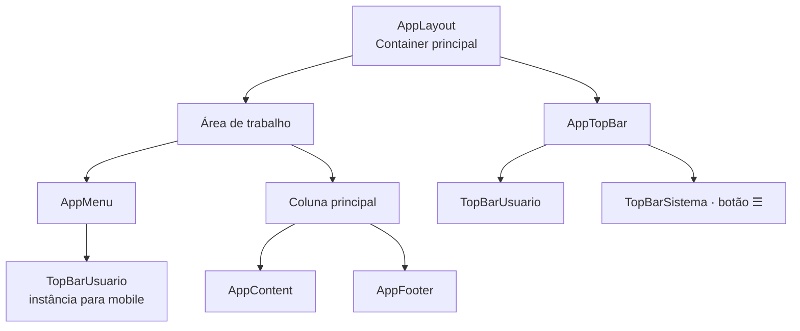
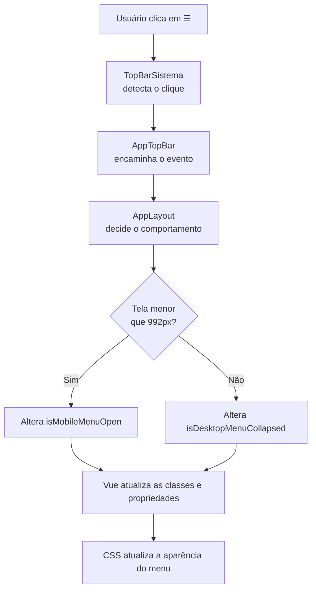

# ☰ Menu recolhível em Vue

> 📖 Guia didático para criar, compreender e reutilizar um menu lateral
> recolhível e responsivo em aplicações Vue.

---

## 🎯 Objetivo deste documento

Este material explica, passo a passo, como foi implementado o botão
`☰` do menu lateral no projeto **Sistema de Controle de Estoque**.

Ao finalizar o estudo, você deverá ser capaz de:

- compreender o caminho completo do clique no botão até a alteração visual;
- recriar um menu lateral recolhível em outro projeto Vue;
- diferenciar o comportamento necessário para desktop e mobile;
- entender os componentes Vue, eventos, propriedades e classes CSS envolvidos;
- diagnosticar os erros mais comuns dessa implementação.

> 💡 Como estudar este material
>
> Leia os tópicos na sequência. Os exemplos serão baseados no código real
> deste projeto e, depois, transformados em um padrão reutilizável para
> qualquer aplicação Vue.

---

## 🧭 Organização do conteúdo

Este documento está dividido em duas partes:

1. **Implementação no Sistema de Controle de Estoque**  
   Explica exatamente como o nosso layout e o nosso botão foram construídos.

2. **Padrão reutilizável para outros projetos Vue**  
   Transforma a solução em uma receita que pode ser aplicada em outra aplicação.

---

## 1. 🔍 Visão geral do comportamento

O botão `☰` controla o menu lateral, mas seu efeito depende da largura atual da tela.

| Ambiente | Largura da tela | Comportamento do botão `☰` |
|---|---:|---|
| Desktop | A partir de `992px` | Recolhe ou restaura o menu lateral dentro do layout. |
| Mobile e tablet | Abaixo de `992px` | Abre ou fecha o menu como um painel sobre o conteúdo. |

### 🖥️ No desktop

O menu lateral faz parte permanente da estrutura da tela.

Inicialmente, ele ocupa uma coluna de `16rem` de largura e mostra ícones e textos, como **HOME** e **Listar Produtos**.

Ao clicar em `☰`:

- a coluna lateral fica menor;
- os textos do usuário e dos itens do menu são ocultados;
- os ícones continuam visíveis;
- a área de conteúdo ganha o espaço que o menu deixou de ocupar.

Clicar novamente restaura o menu completo.

> 💡 Por que não escondemos o menu no desktop?
>
> Porque os ícones continuam oferecendo acesso rápido às funcionalidades.
> O objetivo é ganhar espaço sem fazer a navegação desaparecer.

### 📱 No mobile e no tablet

Em telas menores, não há espaço suficiente para manter uma coluna lateral fixa.

Por isso:

- o menu começa fechado;
- o conteúdo usa praticamente toda a largura disponível;
- ao clicar em `☰`, o menu desliza pela esquerda e fica sobre o conteúdo;
- uma camada escura é exibida atrás do menu;
- clicar nessa camada fecha o menu novamente.

> 💡 Por que o comportamento é diferente?
>
> Um menu estreito com apenas ícones funciona bem no desktop, onde há espaço
> horizontal. Em um celular, ele desperdiçaria uma parte importante da tela e
> dificultaria a leitura. Por isso o menu mobile é temporário e ocupa uma área
> maior enquanto está aberto.

> ⚠️ Atenção
>
> Não existe um único comportamento de “recolher menu”. Temos duas interações
> diferentes: **recolher/restaurar no desktop** e **abrir/fechar no mobile**.

## 2. 🏗️ Arquitetura visual do layout

O layout foi dividido em componentes pequenos. Cada componente representa uma
região visual clara da aplicação.


### 📐 Organização na tela desktop

```
┌─────────────────────┬──────────────────────────────────────────┐
│ TopBarUsuario       │ TopBarSistema: [☰] Sistema de Controle.. │
├─────────────────────┼──────────────────────────────────────────┤
│                     │                                          │
│ AppMenu             │ AppContent                               │
│                     │                                          │
│                     ├──────────────────────────────────────────┤
│                     │ AppFooter                                │
└─────────────────────┴──────────────────────────────────────────┘
```

### 📱 Organização na tela mobile

> No mobile, TopBarUsuario não aparece na barra superior. 
> Ele é exibido dentro de AppMenu quando o painel lateral é aberto

```
┌────────────────────────────────────────────────────────────────┐
│ TopBarSistema: [☰] Sistema de Controle de Estoque               │
├────────────────────────────────────────────────────────────────┤
│ AppContent                                                      │
│                                                                  │
├────────────────────────────────────────────────────────────────┤
│ AppFooter                                                       │
└────────────────────────────────────────────────────────────────┘

Ao clicar em ☰:

┌──────────────────────┐
│ TopBarUsuario        │
├──────────────────────┤
│ AppMenu              │   ← painel temporário sobre o conteúdo
│ • HOME               │
│ • Listar Produtos    │
└──────────────────────┘
```

### 🧩 Papel de cada componente

| Componente      | Papel na arquitetura                                         |
| --------------- | ------------------------------------------------------------ |
| `AppLayout`     | Organiza o layout inteiro e controla o estado do menu.       |
| `AppTopBar`     | Agrupa as duas áreas do topo e encaminha a ação do botão.    |
| `TopBarUsuario` | Exibe as informações resumidas do usuário.                   |
| `TopBarSistema` | Exibe o nome do sistema e contém o botão `☰`.                |
| `AppMenu`       | Exibe os links de navegação e se adapta ao desktop e mobile. |
| `AppContent`    | Reserva a área principal para as páginas da aplicação.       |
| `AppFooter`     | Ocupa a área inferior da coluna principal.                   |

> 💡 Por que TopBarUsuario aparece duas vezes na arquitetura?
>
> Não são dois componentes diferentes. 
> É o mesmo componente reutilizado em dois locais: na barra superior no desktop e dentro do painel lateral no mobile. 
> O CSS define qual instância será visível em cada tamanho de tela.

## 3. 🔄 Caminho completo do clique no botão `☰`

O botão está visualmente em `TopBarSistema`, mas ele não controla o menu
diretamente. Cada componente tem uma responsabilidade específica.


### 📤 A ação sobe pelos componentes

> O clique começa em TopBarSistema e sobe até AppLayout.
>
| Etapa | Componente      | Ação                                            |
| ----: | --------------- | ----------------------------------------------- |
|     1 | `TopBarSistema` | Detecta o clique no botão `☰`.                  |
|     2 | `TopBarSistema` | Emite o evento `toggle-menu`.                   |
|     3 | `AppTopBar`     | Recebe esse evento e o encaminha.               |
|     4 | `AppLayout`     | Recebe o evento final e executa `toggleMenu()`. |

### 🧠 A decisão acontece em AppLayout

> AppLayout verifica a largura atual da tela:

• abaixo de 992px: abre ou fecha o painel mobile;
• a partir de 992px: recolhe ou restaura o menu desktop.

> Essa decisão não deve ficar em TopBarSistema ou em AppMenu.

> 💡 Por que AppLayout toma a decisão?

> Porque ele é o único componente que enxerga simultaneamente o topo, o menu 
e a área de conteúdo. Ele também é o dono do estado que define como todo o
layout deve se comportar.

### 📥 O resultado desce para os componentes

> Depois que AppLayout altera uma variável de estado, o Vue atualiza a tela:

• no desktop, uma classe é adicionada ou removida em AppLayout;
• no mobile, AppMenu recebe uma propriedade informando se deve ficar aberto;
• o CSS interpreta essas classes e propriedades para alterar largura, textos,posição e visibilidade.

### 🔑 Regra de arquitetura utilizada

> Eventos sobem; propriedades descem.

> O componente filho informa que algo aconteceu por um evento. O componente
pai toma a decisão e envia o resultado para os filhos por propriedades.